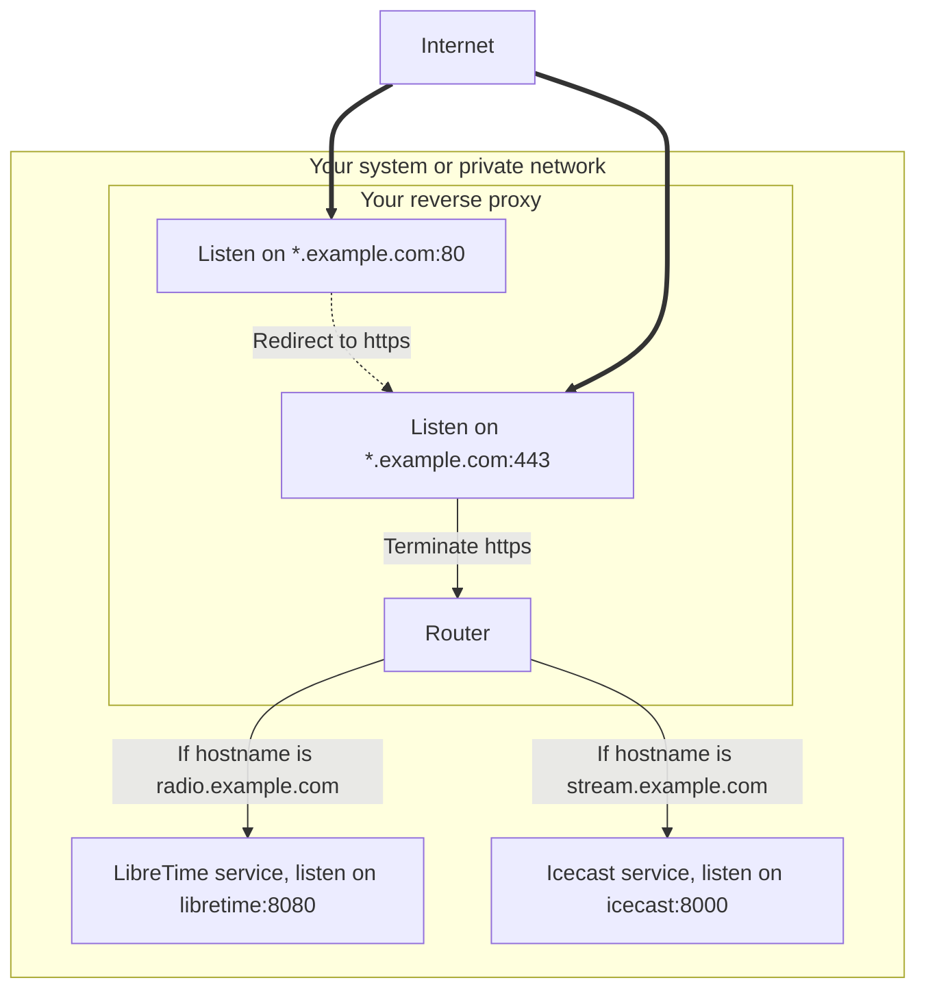

This guide walk you though the steps required to setup a reverse proxy in front of LibreTime.

Setting a reverse proxy in front of LibreTime is recommended, it prevents LibreTime to be
open to the Internet and adds security by enabling `https`.

Setting `ssl/tls` termination on the reverse proxy let's you manage your certificates in
a single place which is simpler and less prone to errors.

Below is a schema that illustrate the goals when setting up a reverse proxy in front of LibreTime:



## Prerequisites

For common setups it is recommended to use 2 domains, one for LibreTime (`radio.example.com`) and one for Icecast (`stream.example.com`). You also need a `ssl/tls` certificate that you can get from Let's Encrypt by using [Certbot](https://certbot.eff.org/).

You need to identify the location of the services that should be exposed to the public:

- the LibreTime web server (usually `localhost:8080`, for documentation clarity we use `libretime:8080`),
- the Icecast server (usually `localhost:8000`, for documentation clarity we use `icecast:8000`).

:::info

If LibreTime is running on the same host as the reverse proxy, you need to change the LibreTime web server default listening port `80` because the reverse proxy needs to listen on the `80`and `443` ports.

:::

:::caution

Be sure that your firewall and network allows communications from the reverse proxy to the services. You can use `ping`, `telnet` and `curl` to check that communication is working.

:::

## Install a reverse proxy

### Apache

:::info

You follow one of these guides to configure Apache with a Let's Encrypt certificate.

- [How To Secure Apache with Let's Encrypt on Ubuntu 20.04](https://www.digitalocean.com/community/tutorials/how-to-secure-apache-with-let-s-encrypt-on-ubuntu-20-04)

:::

:construction: Work in progress

### Nginx

:::info

You follow one of these guides to configure Nginx with a Let's Encrypt certificate.

- [How To Secure Nginx with Let's Encrypt on Ubuntu 20.04](https://www.digitalocean.com/community/tutorials/how-to-secure-nginx-with-let-s-encrypt-on-ubuntu-20-04)

:::

Once you installed nginx and retrieved the required certificates, you can configure the reverse proxy to work with LibreTime.

Paste the following configuration in `/etc/nginx/sites-available/libretime.conf` and be sure to replace:

- `radio.example.com` with your own station url,
- `libretime:8080` with the location of your LibreTime web server;

```nginx
server {
    listen 80;
    server_name radio.example.com;
    location / {
        rewrite ^ https://$server_name$request_uri? permanent;
    }
}

server {
    listen 443 ssl;
    server_name radio.example.com;

    ssl_certificate /etc/letsencrypt/live/radio.example.com/fullchain.pem;
    ssl_certificate_key /etc/letsencrypt/live/radio.example.com/privkey.pem;

    location / {
        proxy_set_header Host              $host;
        proxy_set_header X-Real-IP         $remote_addr;
        proxy_set_header X-Forwarded-For   $proxy_add_x_forwarded_for;
        proxy_set_header X-Forwarded-Proto $scheme;
        proxy_set_header X-Forwarded-Host  $host;
        proxy_set_header X-Forwarded-Port  $server_port;

        proxy_pass http://libretime:8080/;
    }
}
```

Enable the nginx configuration and restart nginx using the commands below:

```bash
ln -s /etc/nginx/sites-available/libretime.conf /etc/nginx/sites-enabled/
sudo systemctl restart nginx
```

### HAProxy

:construction: Work in progress

## Icecast

replace `<hostname>localhost</hostname>` in `/etc/icecast2/icecast.xml` with the following:

```xml
<hostname>icecast.example.com</hostname>
```

This is the hostname that people listening to your stream will connect to and what
LibreTime will use to stream out to them. You will then need to restart Icecast using `sudo systemctl restart icecast2`.

Next, the SSL certificate needs to be generated and the site activated.

```
sudo apt install certbot
sudo systemctl stop nginx
sudo certbot certonly -d radio.example.com -a standalone
sudo systemctl start nginx
```

You can now go to `https://radio.example.com` and go
through the installer. On `General Settings`, you need to change the Webserver Port to
`443` and add the following CORS URLs:

```
https://radio.example.com
http://radio.example.com
https://localhost
http://localhost
```

Finally, the [configuration file](./configuration.md) needs updating. Under `[general]`, `protocol`
needs to be set to `https`:

```ini
[general]
protocol = https
```
