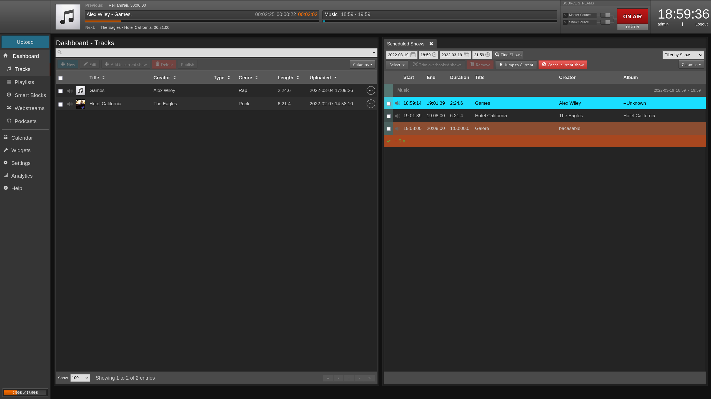

Welcome to the **LibreTime user manual**, you should find guides and tutorials for managers, and content creators to use LibreTime.

## Introduction

## As manager

- [View listeners statistics](./manage/listener-stats.md)
- [View and export the play history](./manage/playout-history.md)

- [Show calendar](./manage/calendar.md)

## As content creator

:construction:

## As guest

:construction:
