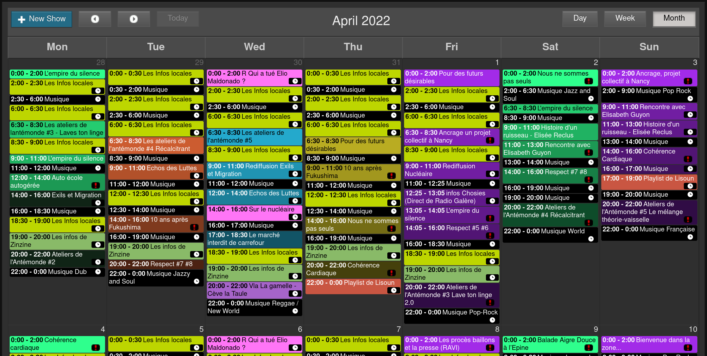
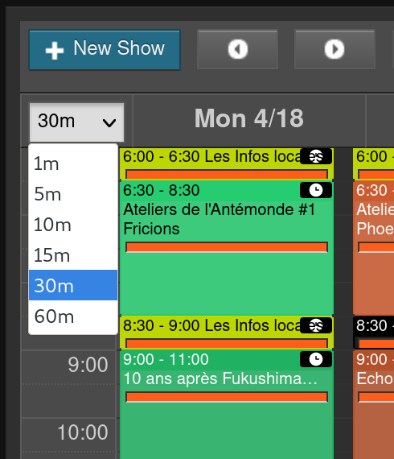
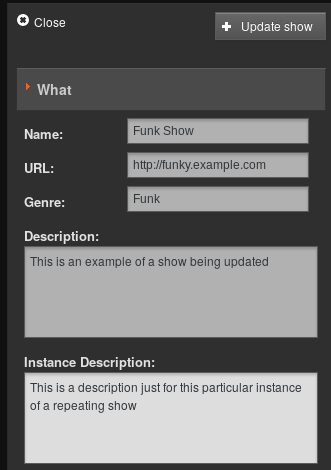
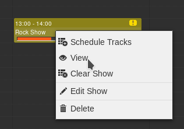

import Tabs from '@theme/Tabs';
import TabItem from '@theme/TabItem';

This guide walk you though the steps required to add, edit or remove shows from the show calendar.

## Calendar browsing

The calendar page has three views: **day**, **week** and **month**, which can be switched using the grey buttons in the top right corner. By default, the **month** view is shown, with today's date highlighted by a pale grey background.

<Tabs>
<TabItem value="month" label="Month" default>

</TabItem>
<TabItem value="week" label="Week">

</TabItem>
<TabItem value="day" label="Day">

</TabItem>
</Tabs>

In the top left corner of the page, you can go back or forward through the **Calendar** by clicking on the buttons which have a small grey triangle in a white circle. Click the **today** button to jump to today's date in the current view. (The **today** button will be greyed out if you are already viewing that date). In the **day** or **week** views, there is also a drop-down menu which allows you to set the resolution displayed for the calendar, ranging from one minute per row to sixty minutes per row.

### Editing a show

Show configuration and metadata can be changed at any time, except for **Date/Time Start** and **Record from Line In?** options, which are fixed after broadcast of that show commences. Click the show in the Calendar, and select **Edit Show** from the pop-up context menu. This opens the **Update Show** box, which is almost exactly the same as the **Add this Show** box. Click the **+ Update show** button at the top or bottom of the box when you are done.

<Tabs>
<TabItem value="edit-show" label="Edit show" default>

</TabItem>
<TabItem value="edit-show-instance" label="Edit show instance">

</TabItem>
</Tabs>

Episodes of repeating shows also have an **Instance Description** field in which you can add details for that particular episode. Click the episode in the Calendar, click **Edit** on the pop-up menu, then click **Edit this instance**. After entering an Instance Description, click the **+ Update show** button.

Alternatively, individual shows can be clicked on and dragged to new days and times in the calendar. However, LibreTime will not allow you to drag a future show into the past, or drag and drop instances of a repeated show. In the **Day** and **Week** views, show length can be adjusted by clicking on the lower edge of the show box, and dragging the edge of the box upwards or downwards. The new show length is calculated automatically.

### Adding content to a show

To add content to a show, click the show in any view on the Calendar, and select **Schedule Tracks** from the pop-up menu. Shows that do not yet contain any scheduled content are marked with a red exclamation mark icon, to the right of the show start and end times in the top bar. Shows partially filled with content have a yellow exclamation mark icon. During playout of the show, a green play icon will also be shown in the top bar.

The **Schedule Tracks** action opens a window with the name of the show. Like when using the **Now Playing** page, you can search for content items and add them to the show schedule on the right side of the page. Refer to the _Now Playing_ chapter for details.

When your show has all the required content, click the **OK** button in the bottom right corner to close the window. Back in the **Calendar**, click the show and select **View** from the pop-up menu to view a list of content now included in the show.

The **Contents of Show** window is a read-only interface featuring an orange bar which indicates how much media has been added to the show. Click the **OK** button in the bottom right corner, or the white **x** icon in the top right corner, to close the window.

### Removing content from a show

To remove an individual item from a show, click on the show in the **Calendar**, and select **Schedule Tracks** from the pop-up menu. In the window which opens, click any item you wish to remove from the show, then click **Delete** on the pop-up menu, or check the box in the item's row then click the **Remove** icon at the top of the table. To remove all files and playlists from a show, click on the show in the **Calendar**, and select **Clear Show** from the pop-up menu.

### Deleting an upcoming show

To delete an upcoming instance of a repeating show, click on the show in the **Calendar**, and select **Delete**, then **Delete Instance** from the pop-up menu. If you wish to delete all future instances of a repeating show, select **Delete Instance and All Following** from the pop-up menu.

You cannot delete or remove content from shows that have already played out. These shows have only one option on the pop-up menu, which is **View**.

### Cancelling playout

If you wish to cancel playout of a show while it is running, click on the show in the **Calendar** and select **Cancel Show** from the pop-up menu. This action cannot be undone.
