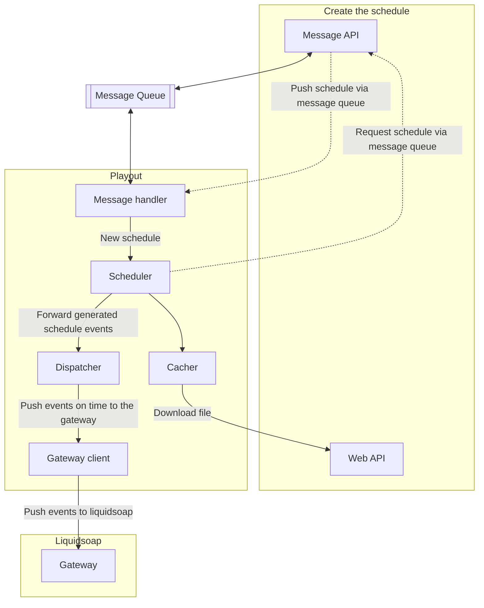

# LibreTime Playout

## Design

-> Message handler -> receive messages from the message queue
-> Scheduler -> build event stream
-> Event handler -> dispatch events to workers
-> Download Worker -> download missing files
-> Play queue Worker -> rebuild play queue -> dispatch to liquidsoap

Threads and handlers:
[![](https://mermaid.ink/svg/eyJjb2RlIjoic3RhdGVEaWFncmFtLXYyXG4gICAgc3RhdGUgXCJDaGVjayBsaXF1aWRzb2FwIGNvbm5lY3Rpdml0eVwiIGFzIGNoZWNrX2xpcXVpZHNvYXBcbiAgICBbKl0gLS0-IGNoZWNrX2xpcXVpZHNvYXBcblxuICAgIHN0YXRlIHN0YXJ0IDw8Zm9yaz4-XG4gICAgc3RhdGUgc3RvcCA8PGZvcms-PlxuICAgIGNoZWNrX2xpcXVpZHNvYXAgLS0-IHN0YXJ0XG5cbiAgICBzdGF0ZSBcIlN0YXJ0IE1lc3NhZ2UgSGFuZGxlclwiIGFzIHN0YXJ0X21lc3NhZ2VfaGFuZGxlclxuICAgIHN0YXJ0IC0tPiBzdGFydF9tZXNzYWdlX2hhbmRsZXJcbiAgICBzdGFydF9tZXNzYWdlX2hhbmRsZXIgLS0-IHN0b3BcblxuICAgIHN0YXRlIFwiU3RhcnQgRmlsZVwiIGFzIHN0YXJ0X2ZpbGVfaGFuZGxlclxuICAgIHN0YXJ0IC0tPiBzdGFydF9maWxlX2hhbmRsZXJcbiAgICBzdGFydF9maWxlX2hhbmRsZXIgLS0-IHN0b3BcbiAgICBcbiAgICBzdGF0ZSBcIlN0YXJ0IEZldGNoXCIgYXMgc3RhcnRfZmV0Y2hfaGFuZGxlclxuICAgIHN0YXJ0IC0tPiBzdGFydF9mZXRjaF9oYW5kbGVyXG4gICAgc3RhcnRfZmV0Y2hfaGFuZGxlciAtLT4gc3RvcFxuICAgIFxuICAgIHN0YXRlIFwiU3RhcnQgUHVzaFwiIGFzIHN0YXJ0X3B1c2hfaGFuZGxlclxuICAgIHN0YXRlIFwiU3RhcnQgTGlxdWlkc29hcCBRdWV1ZVwiIGFzIHN0YXJ0X2xpcXVpZHNvYXBfcXVldWVfaGFuZGxlclxuICAgIHN0YXJ0IC0tPiBzdGFydF9wdXNoX2hhbmRsZXJcbiAgICBzdGFydF9wdXNoX2hhbmRsZXIgLS0-IHN0YXJ0X2xpcXVpZHNvYXBfcXVldWVfaGFuZGxlclxuXG4gICAgc3RhcnRfbGlxdWlkc29hcF9xdWV1ZV9oYW5kbGVyIC0tPiBzdG9wXG4gICAgXG4gICAgc3RhdGUgXCJTdGFydCBSZWNvcmRlclwiIGFzIHN0YXJ0X3JlY29yZGVyX2hhbmRsZXJcbiAgICBzdGFydCAtLT4gc3RhcnRfcmVjb3JkZXJfaGFuZGxlclxuICAgIHN0YXJ0X3JlY29yZGVyX2hhbmRsZXIgLS0-IHN0b3BcbiAgICBcbiAgICBzdGF0ZSBcIlN0YXJ0IFN0YXRzXCIgYXMgc3RhcnRfc3RhdHNfaGFuZGxlclxuICAgIHN0YXJ0IC0tPiBzdGFydF9zdGF0c19oYW5kbGVyXG4gICAgc3RhcnRfc3RhdHNfaGFuZGxlciAtLT4gc3RvcFxuICAgXG4gICAgc3RvcCAtLT4gWypdIiwibWVybWFpZCI6eyJ0aGVtZSI6ImRlZmF1bHQifSwidXBkYXRlRWRpdG9yIjpmYWxzZSwiYXV0b1N5bmMiOnRydWUsInVwZGF0ZURpYWdyYW0iOmZhbHNlfQ)](https://mermaid.live/edit/#eyJjb2RlIjoic3RhdGVEaWFncmFtLXYyXG4gICAgc3RhdGUgXCJDaGVjayBsaXF1aWRzb2FwIGNvbm5lY3Rpdml0eVwiIGFzIGNoZWNrX2xpcXVpZHNvYXBcbiAgICBbKl0gLS0-IGNoZWNrX2xpcXVpZHNvYXBcblxuICAgIHN0YXRlIHN0YXJ0IDw8Zm9yaz4-XG4gICAgc3RhdGUgc3RvcCA8PGZvcms-PlxuICAgIGNoZWNrX2xpcXVpZHNvYXAgLS0-IHN0YXJ0XG5cbiAgICBzdGF0ZSBcIlN0YXJ0IE1lc3NhZ2UgSGFuZGxlclwiIGFzIHN0YXJ0X21lc3NhZ2VfaGFuZGxlclxuICAgIHN0YXJ0IC0tPiBzdGFydF9tZXNzYWdlX2hhbmRsZXJcbiAgICBzdGFydF9tZXNzYWdlX2hhbmRsZXIgLS0-IHN0b3BcblxuICAgIHN0YXRlIFwiU3RhcnQgRmlsZVwiIGFzIHN0YXJ0X2ZpbGVfaGFuZGxlclxuICAgIHN0YXJ0IC0tPiBzdGFydF9maWxlX2hhbmRsZXJcbiAgICBzdGFydF9maWxlX2hhbmRsZXIgLS0-IHN0b3BcbiAgICBcbiAgICBzdGF0ZSBcIlN0YXJ0IEZldGNoXCIgYXMgc3RhcnRfZmV0Y2hfaGFuZGxlclxuICAgIHN0YXJ0IC0tPiBzdGFydF9mZXRjaF9oYW5kbGVyXG4gICAgc3RhcnRfZmV0Y2hfaGFuZGxlciAtLT4gc3RvcFxuICAgIFxuICAgIHN0YXRlIFwiU3RhcnQgUHVzaFwiIGFzIHN0YXJ0X3B1c2hfaGFuZGxlclxuICAgIHN0YXRlIFwiU3RhcnQgTGlxdWlkc29hcCBRdWV1ZVwiIGFzIHN0YXJ0X2xpcXVpZHNvYXBfcXVldWVfaGFuZGxlclxuICAgIHN0YXJ0IC0tPiBzdGFydF9wdXNoX2hhbmRsZXJcbiAgICBzdGFydF9wdXNoX2hhbmRsZXIgLS0-IHN0YXJ0X2xpcXVpZHNvYXBfcXVldWVfaGFuZGxlclxuXG4gICAgc3RhcnRfbGlxdWlkc29hcF9xdWV1ZV9oYW5kbGVyIC0tPiBzdG9wXG4gICAgXG4gICAgc3RhdGUgXCJTdGFydCBSZWNvcmRlclwiIGFzIHN0YXJ0X3JlY29yZGVyX2hhbmRsZXJcbiAgICBzdGFydCAtLT4gc3RhcnRfcmVjb3JkZXJfaGFuZGxlclxuICAgIHN0YXJ0X3JlY29yZGVyX2hhbmRsZXIgLS0-IHN0b3BcbiAgICBcbiAgICBzdGF0ZSBcIlN0YXJ0IFN0YXRzXCIgYXMgc3RhcnRfc3RhdHNfaGFuZGxlclxuICAgIHN0YXJ0IC0tPiBzdGFydF9zdGF0c19oYW5kbGVyXG4gICAgc3RhcnRfc3RhdHNfaGFuZGxlciAtLT4gc3RvcFxuICAgXG4gICAgc3RvcCAtLT4gWypdIiwibWVybWFpZCI6IntcbiAgXCJ0aGVtZVwiOiBcImRlZmF1bHRcIlxufSIsInVwZGF0ZUVkaXRvciI6ZmFsc2UsImF1dG9TeW5jIjp0cnVlLCJ1cGRhdGVEaWFncmFtIjpmYWxzZX0)

Schedule event flow:
[![](https://mermaid.ink/svg/eyJjb2RlIjoic3RhdGVEaWFncmFtLXYyXG4gICAgWypdIC0tPiByZWNlaXZlZF9ldmVudFxuXG4gICAgc3RhdGUgZmV0Y2hfcXVldWUge1xuICAgICAgICBbKl0gLS0-IHByb2Nlc3Nfc2NoZWR1bGU6IHVwZGF0ZV9zY2hlZHVsZVxuICAgIH1cblxuICAgIHJlY2VpdmVkX2V2ZW50IC0tPiBmZXRjaF9xdWV1ZVxuXG4gICAgc3RhdGUgbWVkaWFfcXVldWUge1xuICAgICAgICBbKl0gIC0tPiBjb3B5X2ZpbGVcbiAgICB9XG4gICAgcHJvY2Vzc19zY2hlZHVsZSAtLT4gbWVkaWFfcXVldWVcblxuICAgIHN0YXRlIHB1c2hfcXVldWUge1xuICAgICAgICBbKl0gLS0-IHNlcGVyYXRlX3ByZXNlbnRfZnV0dXJlXG5cbiAgICAgICAgc2VwZXJhdGVfcHJlc2VudF9mdXR1cmUgLS0-IHZlcmlmeV9jb3JyZWN0X3ByZXNlbnRfbWVkaWFcbiAgICAgICAgbm90ZSByaWdodCBvZiB2ZXJpZnlfY29ycmVjdF9wcmVzZW50X21lZGlhIDogSXMgdGhhdCB1c2VkIHRvIGZvcmNlIGEgZGlyZWN0IGNoYW5nZSA_XG5cbiAgICAgICAgc2VwZXJhdGVfcHJlc2VudF9mdXR1cmUgLS0-IGZ1dHVyZV9zY2hlZHVsZWRfcXVldWU6IHNjaGVkdWxlZF9mb3JfZnV0dXJlXG4gICAgICAgIHN0YXRlIGZ1dHVyZV9zY2hlZHVsZWRfcXVldWUge1xuICAgICAgICAgICAgWypdIC0tPiB3YWl0X3VudGlsX3BsYXlcbiAgICAgICAgfVxuICAgIH1cblxuICAgIHByb2Nlc3Nfc2NoZWR1bGUgLS0-IHB1c2hfcXVldWVcblxuICAgIHZlcmlmeV9jb3JyZWN0X3ByZXNlbnRfbWVkaWEgLS0-IGxpcXVpZHNvYXA6IGN1cnJlbnRseV9wbGF5aW5nXG4gICAgd2FpdF91bnRpbF9wbGF5IC0tPiBsaXF1aWRzb2FwXG5cbiAgICBsaXF1aWRzb2FwIC0tPiBbKl1cblxuICAgIFxuIiwibWVybWFpZCI6eyJ0aGVtZSI6ImRlZmF1bHQifSwidXBkYXRlRWRpdG9yIjpmYWxzZSwiYXV0b1N5bmMiOnRydWUsInVwZGF0ZURpYWdyYW0iOmZhbHNlfQ)](https://mermaid.live/edit#eyJjb2RlIjoic3RhdGVEaWFncmFtLXYyXG4gICAgWypdIC0tPiByZWNlaXZlZF9ldmVudFxuXG4gICAgc3RhdGUgZmV0Y2hfcXVldWUge1xuICAgICAgICBbKl0gLS0-IHByb2Nlc3Nfc2NoZWR1bGU6IHVwZGF0ZV9zY2hlZHVsZVxuICAgIH1cblxuICAgIHJlY2VpdmVkX2V2ZW50IC0tPiBmZXRjaF9xdWV1ZVxuXG4gICAgc3RhdGUgbWVkaWFfcXVldWUge1xuICAgICAgICBbKl0gIC0tPiBjb3B5X2ZpbGVcbiAgICB9XG4gICAgcHJvY2Vzc19zY2hlZHVsZSAtLT4gbWVkaWFfcXVldWVcblxuICAgIHN0YXRlIHB1c2hfcXVldWUge1xuICAgICAgICBbKl0gLS0-IHNlcGVyYXRlX3ByZXNlbnRfZnV0dXJlXG5cbiAgICAgICAgc2VwZXJhdGVfcHJlc2VudF9mdXR1cmUgLS0-IHZlcmlmeV9jb3JyZWN0X3ByZXNlbnRfbWVkaWFcbiAgICAgICAgbm90ZSByaWdodCBvZiB2ZXJpZnlfY29ycmVjdF9wcmVzZW50X21lZGlhIDogSXMgdGhhdCB1c2VkIHRvIGZvcmNlIGEgZGlyZWN0IGNoYW5nZSA_XG5cbiAgICAgICAgc2VwZXJhdGVfcHJlc2VudF9mdXR1cmUgLS0-IGZ1dHVyZV9zY2hlZHVsZWRfcXVldWU6IHNjaGVkdWxlZF9mb3JfZnV0dXJlXG4gICAgICAgIHN0YXRlIGZ1dHVyZV9zY2hlZHVsZWRfcXVldWUge1xuICAgICAgICAgICAgWypdIC0tPiB3YWl0X3VudGlsX3BsYXlcbiAgICAgICAgfVxuICAgIH1cblxuICAgIHByb2Nlc3Nfc2NoZWR1bGUgLS0-IHB1c2hfcXVldWVcblxuICAgIHZlcmlmeV9jb3JyZWN0X3ByZXNlbnRfbWVkaWEgLS0-IGxpcXVpZHNvYXA6IGN1cnJlbnRseV9wbGF5aW5nXG4gICAgd2FpdF91bnRpbF9wbGF5IC0tPiBsaXF1aWRzb2FwXG5cbiAgICBsaXF1aWRzb2FwIC0tPiBbKl1cblxuICAgIFxuIiwibWVybWFpZCI6IntcbiAgXCJ0aGVtZVwiOiBcImRlZmF1bHRcIlxufSIsInVwZGF0ZUVkaXRvciI6ZmFsc2UsImF1dG9TeW5jIjp0cnVlLCJ1cGRhdGVEaWFncmFtIjpmYWxzZX0)

